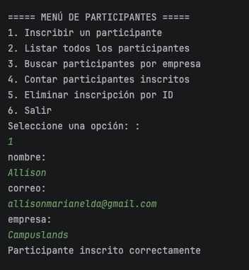
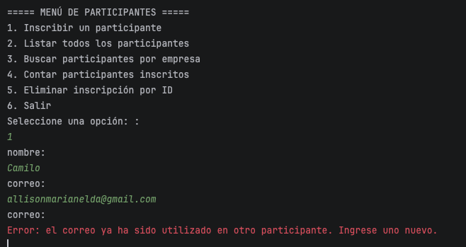
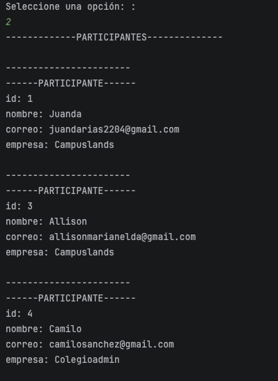
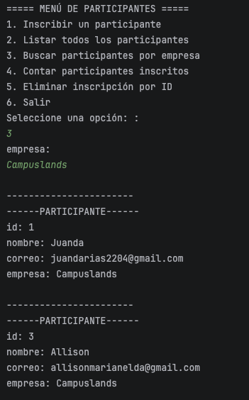
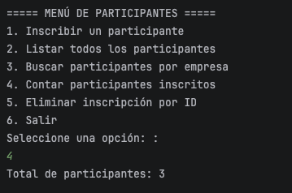
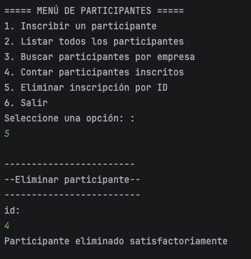
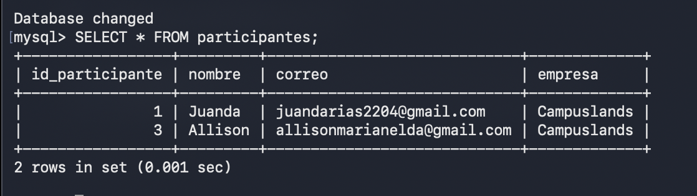

# Sistema de Gestión de Participantes

Aplicación de consola desarrollada en **Java** para gestionar la inscripción de participantes y almacenar la información en una base de datos **MySQL**.

El proyecto implementa una arquitectura sencilla basada en separación de responsabilidades, utilizando un modelo (`Participante`), un DAO (`ParticipanteDAO`), una clase para la conexión a la base de datos (`ConexionDB`), utilidades para la entrada de datos (`ScannerUtils`) y una clase principal para controlar el menú (`Main`).

---

## 📋 Descripción del proyecto

El sistema permite administrar participantes de un evento mediante un menú interactivo.

Cada participante contiene la siguiente información:

- ID del participante.
- Nombre.
- Correo electrónico.
- Empresa.

La información es almacenada en una base de datos MySQL y las operaciones se realizan mediante JDBC.

---

## 🚀 Funcionalidades

El menú principal cuenta con las siguientes opciones:

1. **Inscribir un participante**
   - Solicita nombre, correo y empresa.
   - Valida que los campos de texto no estén vacíos.
   - Verifica que el correo electrónico no haya sido registrado previamente.
   - Guarda el participante en la base de datos.

2. **Listar todos los participantes**
   - Consulta todos los registros almacenados.
   - Muestra el ID, nombre, correo y empresa de cada participante.

3. **Buscar participantes por empresa**
   - Permite ingresar el nombre de una empresa.
   - Consulta y muestra los participantes asociados a dicha empresa.

4. **Contar participantes inscritos**
   - Obtiene mediante SQL la cantidad total de participantes registrados.

5. **Eliminar inscripción por ID**
   - Solicita el ID del participante.
   - Verifica que el ID exista.
   - Elimina el registro correspondiente de la base de datos.

6. **Salir**
   - Finaliza la ejecución del programa.

---

## 🛠️ Tecnologías utilizadas

- **Java**
- **JDBC**
- **MySQL**
- **SQL**
- **IntelliJ IDEA / IDE compatible con Java**
- **Maven o gestión manual de dependencias**, según la configuración del proyecto.

---

## 📁 Estructura del proyecto

Una posible estructura del proyecto es:

```text
src/
└── main/
    └── java/
        └── com/
            └── apex/
                ├── database/
                │   └── ConexionDB.java
                │
                ├── dao/
                │   └── ParticipanteDAO.java
                │
                ├── models/
                │   └── Participante.java
                │
                ├── util/
                │   └── ScannerUtils.java
                │
                └── views/
                    └── Main.java
```

### Responsabilidad de cada paquete

#### `com.apex.models`

Contiene las clases que representan los datos del sistema.

- `Participante.java`

#### `com.apex.dao`

Contiene las operaciones de acceso a datos.

- `ParticipanteDAO.java`

Incluye operaciones como:

- Crear participantes.
- Buscar por ID.
- Actualizar participantes.
- Eliminar participantes.
- Listar participantes.
- Buscar por empresa.
- Contar participantes.

#### `com.apex.database`

Contiene la configuración y conexión con la base de datos.

- `ConexionDB.java`

#### `com.apex.util`

Contiene herramientas para capturar y validar información ingresada por el usuario.

- `ScannerUtils.java`

#### `com.apex.views`

Contiene la interfaz de consola y el flujo principal del programa.

- `Main.java`

---

## 🗄️ Base de datos

El proyecto utiliza una base de datos MySQL llamada:

```text
reto_DB
```

La tabla utilizada por la aplicación es:

```text
participantes
```

La tabla debe contener, como mínimo, los siguientes campos:

| Campo | Descripción |
|---|---|
| `id_participante` | Identificador único del participante |
| `nombre` | Nombre del participante |
| `correo` | Correo electrónico |
| `empresa` | Empresa a la que pertenece |

### Ejemplo de creación de la base de datos

```sql
CREATE DATABASE reto_DB;

USE reto_DB;

CREATE TABLE participantes (
    id_participante INT AUTO_INCREMENT PRIMARY KEY,
    nombre VARCHAR(100) NOT NULL,
    correo VARCHAR(150) NOT NULL UNIQUE,
    empresa VARCHAR(100) NOT NULL
);
```

> La restricción `UNIQUE` sobre el correo proporciona una validación adicional a nivel de base de datos para evitar correos duplicados.

---

## 🔌 Configuración de la conexión

La conexión se encuentra en:

```text
src/main/java/com/apex/database/ConexionDB.java
```

Actualmente utiliza una configuración similar a:

```java
private static final String URL =
        "jdbc:mysql://localhost:3306/reto_DB";

private static final String USER = "root";
private static final String PASSWORD = "*******";
```

Antes de ejecutar el proyecto, se deben configurar correctamente:

- Servidor MySQL.
- Puerto de MySQL.
- Nombre de la base de datos.
- Usuario.
- Contraseña.

También es necesario contar con el **driver JDBC de MySQL** dentro del proyecto.

---

## 🔄 Flujo de funcionamiento

El flujo general de la aplicación es:

```text
Usuario
   │
   ▼
Main
   │
   ▼
ScannerUtils
   │
   ▼
Participante
   │
   ▼
ParticipanteDAO
   │
   ▼
ConexionDB
   │
   ▼
MySQL
   │
   ▼
Tabla participantes
```

### Inscripción de un participante

```text
Usuario ingresa datos
        │
        ▼
ScannerUtils valida datos
        │
        ▼
Se verifica que el correo no esté registrado
        │
        ▼
Se crea un objeto Participante
        │
        ▼
ParticipanteDAO.crear()
        │
        ▼
INSERT en MySQL
```

### Eliminación de un participante

```text
Usuario ingresa ID
        │
        ▼
Se consultan los participantes
        │
        ▼
Se verifica que el ID exista
        │
        ▼
ParticipanteDAO.eliminar(id)
        │
        ▼
DELETE en MySQL
```

---

## ✅ Validaciones implementadas

El sistema cuenta con diferentes validaciones para controlar la información ingresada.

### Campos de texto

`ScannerUtils.capturarTexto()` evita que el usuario pueda registrar un valor vacío.

### Correo electrónico

`ScannerUtils.capturarCorreo()` verifica que:

- El correo no esté vacío.
- El correo no haya sido utilizado anteriormente.
- La comparación del correo se realice sin distinguir entre mayúsculas y minúsculas.

La verificación utiliza:

```java
equalsIgnoreCase()
```

### ID

`ScannerUtils.eliminarParticipante()` verifica que:

- El valor introducido sea numérico.
- El ID exista entre los participantes registrados.

---

## 🧩 Patrón DAO

El proyecto utiliza el patrón **DAO (Data Access Object)** para separar la lógica relacionada con la base de datos del resto de la aplicación.

La clase:

```text
ParticipanteDAO
```

se encarga de ejecutar las consultas SQL.

Esto permite que `Main` no tenga que manejar directamente conexiones, `PreparedStatement` o `ResultSet`.

Entre los métodos implementados se encuentran:

```java
crear()
buscarPorId()
actualizar()
eliminar()
listarTodos()
buscarPorEmpresa()
contarParticipantes()
```

---

## 🔐 Uso de PreparedStatement

Las consultas SQL utilizan `PreparedStatement`, por ejemplo:

```java
PreparedStatement ps = conn.prepareStatement(sql);
```

Los valores se agregan mediante parámetros:

```java
ps.setString(1, participante.getNombre());
ps.setString(2, participante.getCorreo());
ps.setString(3, participante.getEmpresa());
```

Esto permite separar los datos de la consulta SQL y evita construir consultas mediante concatenación directa de valores ingresados por el usuario.

---

## ▶️ Ejecución

Para ejecutar el proyecto:

1. Iniciar el servidor MySQL.
2. Crear la base de datos `reto_DB`.
3. Crear la tabla `participantes`.
4. Configurar las credenciales en `ConexionDB.java`.
5. Verificar que el driver JDBC de MySQL esté disponible.
6. Ejecutar la clase:

```text
com.apex.views.Main
```

---

## 🖥️ Menú principal

Al ejecutar la aplicación se presenta el siguiente menú:

```text
===== MENÚ DE PARTICIPANTES =====
1. Inscribir un participante
2. Listar todos los participantes
3. Buscar participantes por empresa
4. Contar participantes inscritos
5. Eliminar inscripción por ID
6. Salir
```

---

# 📸 Evidencias

En esta sección se deben agregar las evidencias correspondientes al funcionamiento del proyecto.

> **Nota:** Las imágenes serán agregadas posteriormente.

## Evidencia 1 — Inscripción de participante





---

## Evidencia 2 — Validación de correo duplicado





---

## Evidencia 3 — Listado de participantes





---

## Evidencia 4 — Búsqueda por empresa




---

## Evidencia 5 — Conteo de participantes




---

## Evidencia 6 — Eliminación de participante




---

## Evidencia 7 — Base de datos




---

# 📌 Conclusión

El proyecto implementa un sistema básico de gestión de participantes utilizando Java, JDBC y MySQL.

La aplicación permite realizar las principales operaciones de administración de participantes mediante un menú de consola y mantiene separadas las responsabilidades entre la interfaz, las utilidades de entrada, el modelo, el acceso a datos y la conexión con la base de datos.

La implementación de `PreparedStatement`, validaciones de entrada y separación mediante DAO permite mantener una estructura organizada y facilitar el mantenimiento del proyecto.
